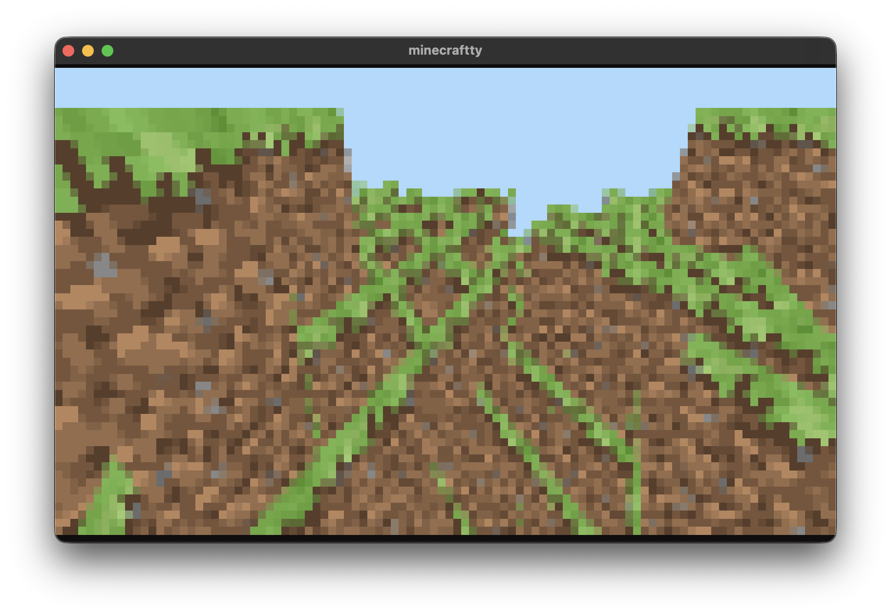

# MinecraftTTY

A terminal-based 3D voxel renderer inspired by Minecraft, written in Rust using wgpu for GPU-accelerated rendering.



## Features

- **3D Voxel Rendering**: Real-time 3D block world rendering in your terminal
- **GPU Acceleration**: Uses wgpu for hardware-accelerated graphics
- **Terminal Graphics**: Renders using Unicode block characters (▀) with 24-bit color
- **Texture Support**: Loads and displays block textures from PNG files
- **Camera Controls**: WASD movement with mouse-look style controls
- **Cross-Platform**: Works on macOS, Linux, and Windows
- **High Resolution**: 2x supersampling for crisp visuals in terminal

## Controls

- **WASD** or **Arrow Keys**: Move around
- **Q/E**: Move up/down
- **H/L**: Look left/right
- **J/K**: Look up/down
- **X** or **Esc**: Exit

## Installation

### Prerequisites

- Rust (latest stable)
- Vulkan/Metal/DirectX compatible graphics drivers
- A terminal with 24-bit color support

### Building

```bash
git clone https://github.com/raphamorim/minecraftty
cd minecraftty
cargo build --release
```

### Running

```bash
cargo run --release
```

## How It Works

MinecraftTTY uses a unique approach to render 3D graphics in the terminal:

1. **GPU Rendering**: Uses wgpu to render the 3D scene to an off-screen texture
2. **Pixel Sampling**: Reads the rendered pixels back from the GPU
3. **Terminal Mapping**: Maps pairs of pixels to Unicode "▀" characters
4. **Color Encoding**: Uses ANSI 24-bit color codes for accurate color reproduction

Each terminal character represents 2 vertical pixels:
- **Foreground color**: Bottom pixel
- **Background color**: Top pixel
- **Character**: "▀" (upper half block)

This technique allows for surprisingly detailed 3D graphics in a text terminal.

## Technical Details

- **Renderer**: wgpu (WebGPU implementation)
- **Math**: glam for linear algebra
- **Noise**: Perlin noise for terrain generation
- **Terminal**: crossterm for cross-platform terminal control
- **Textures**: PNG texture atlas support

## Performance

The renderer targets 30 FPS and automatically scales to your terminal size. For best performance:

- Use a GPU with Vulkan/Metal/DirectX support
- Ensure your terminal supports 24-bit color
- Consider reducing terminal size for better frame rates

## Inspiration

This project is inspired by and builds upon the work of [zacoons/minecraftty](https://codeberg.org/zacoons/minecraftty), originally written in Zig. This Rust implementation adds:

- Texture support with PNG loading
- Improved terminal rendering with synchronized updates
- Enhanced camera controls
- Cross-platform compatibility improvements
- Higher resolution rendering with pixel averaging

## Credits

- **Original Concept**: [zacoons](https://codeberg.org/zacoons) for the original MinecraftTTY in Zig
- **Inspiration**: The work shown in [this YouTube video](https://youtu.be/6zfXM-6yPJQ)
- **Rust Implementation**: Enhanced and ported to Rust with additional features